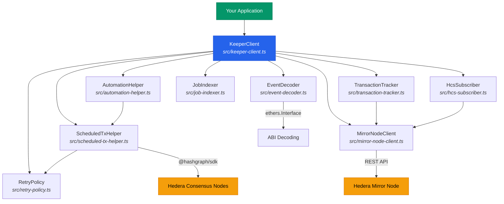
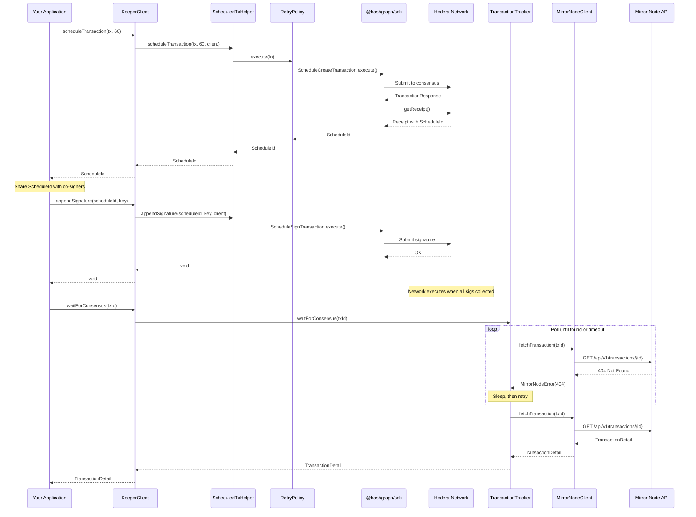
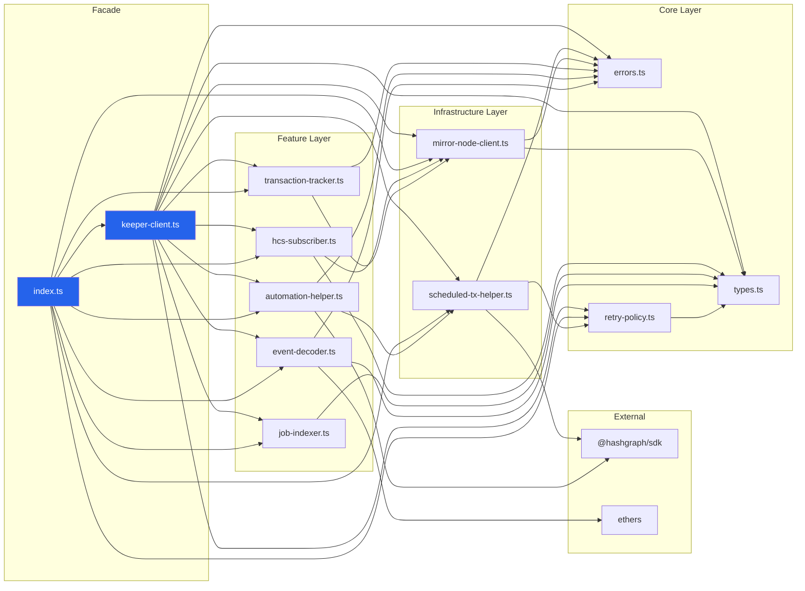
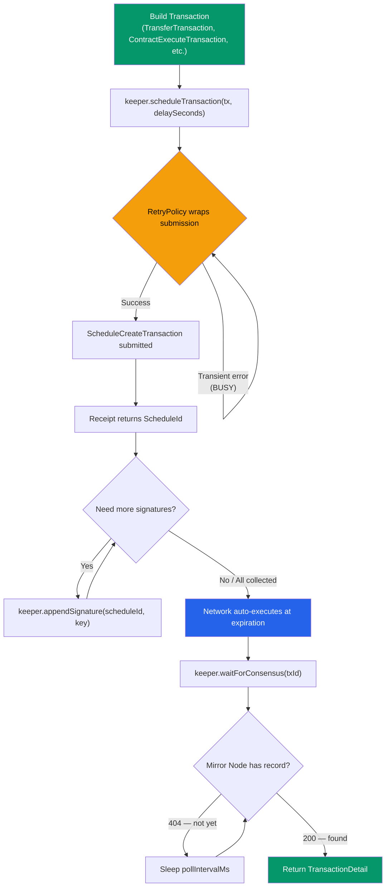
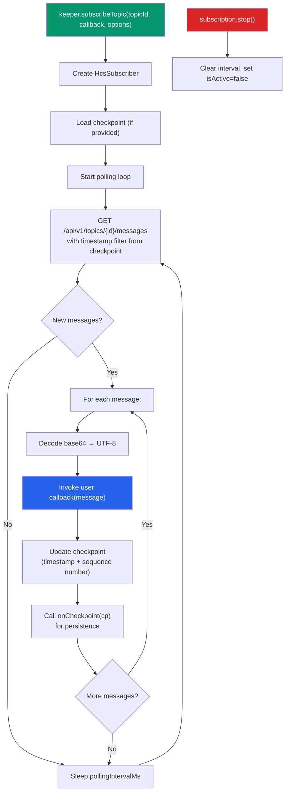
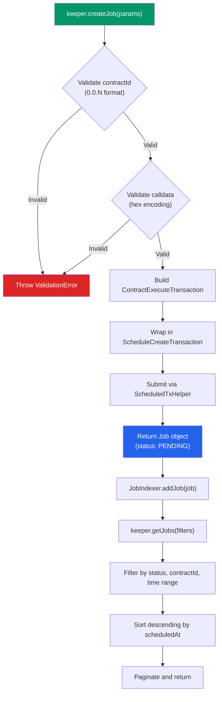
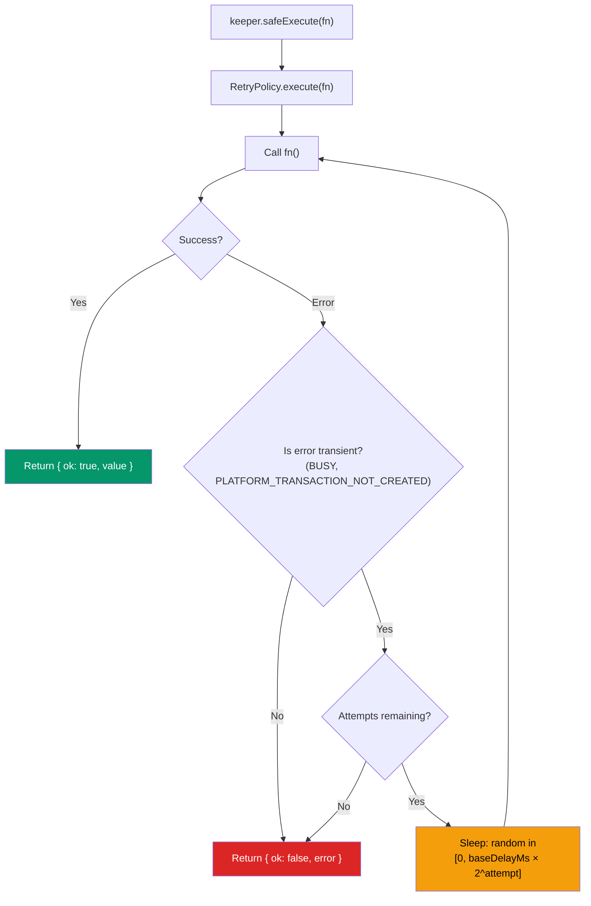

# @hiero/keeper

TypeScript automation toolkit for Hiero/Hedera networks — scheduled transactions, mirror node queries, HCS subscriptions, contract automation, and resilient execution with built-in retry logic.

[](https://github.com/abdulsamadplayground/HIERO_KEEPER_SDK/actions)

---

## Table of Contents

- [Architecture Overview](#architecture-overview)
- [End-to-End Flow](#end-to-end-flow)
- [Module Dependency Graph](#module-dependency-graph)
- [Installation](#installation)
- [Quickstart](#quickstart)
- [Running the Project](#running-the-project)
- [API Reference](#api-reference)
  - [KeeperClient](#keeperclient)
  - [RetryPolicy](#retrypolicy)
  - [MirrorNodeClient](#mirrornodeclient)
  - [HcsSubscriber](#hcssubscriber)
  - [ScheduledTxHelper](#scheduledtxhelper)
  - [TransactionTracker](#transactiontracker)
  - [AutomationHelper](#automationhelper)
  - [JobIndexer](#jobindexer)
  - [EventDecoder](#eventdecoder)
- [Scheduled Transaction Flow](#scheduled-transaction-flow)
- [HCS Subscription Flow](#hcs-subscription-flow)
- [Contract Automation Flow](#contract-automation-flow)
- [Retry and Error Handling Flow](#retry-and-error-handling-flow)
- [Examples](#examples)
- [Testing](#testing)
- [Project Structure](#project-structure)
- [Live Dashboard](#live-dashboard)
- [Contributing](#contributing)

---

## Architecture Overview

The SDK is organized as a facade pattern. [`KeeperClient`](./src/keeper-client.ts) is the single entry point that composes all internal modules and exposes a unified API.



---

## End-to-End Flow

This diagram shows the complete lifecycle of a scheduled transaction — from creation through multi-sig signing to consensus confirmation:



---

## Module Dependency Graph

Shows how internal modules depend on each other and on external packages:



---

## Installation

```bash
npm install @hiero/keeper
```

Requires Node.js >= 18 and a Hedera/Hiero network account with operator credentials.

---

## Quickstart

```typescript
import { KeeperClient } from "@hiero/keeper";

// 1. Initialize with your testnet credentials
const keeper = new KeeperClient({
  network: "testnet",                              // "mainnet" | "testnet" | "previewnet"
  operatorId: "0.0.12345",                         // your account ID
  operatorKey: "302e020100300506032b657004220420…", // DER-encoded private key
});

// 2. Schedule a transaction for delayed execution
const scheduleId = await keeper.scheduleTransaction(transferTx, 60);

// 3. Add a co-signer's signature (multi-sig)
await keeper.appendSignature(scheduleId, secondSignerKey);

// 4. Wait for the network to execute it
const result = await keeper.waitForConsensus(scheduleId.toString());
console.log(result.result); // "SUCCESS"

// 5. Subscribe to HCS topic messages with checkpointing
const sub = keeper.subscribeTopic("0.0.99999", (msg) => {
  console.log(`[seq ${msg.sequence_number}] ${msg.message}`);
}, {
  pollingIntervalMs: 3000,
  onCheckpoint: (cp) => saveToFile(cp),
});

// 6. Decode contract event logs
const decoded = keeper.decodeEventLog(contractLog, transferAbi);
console.log(decoded.eventName, decoded.args);

// 7. Retry-wrapped execution for transient errors
const safeResult = await keeper.safeExecute(() => someHederaCall());
if (safeResult.ok) console.log(safeResult.value);
```

---

## Running the Project

### Prerequisites

- Node.js >= 18 ([download](https://nodejs.org/))
- npm (comes with Node.js)
- Git

### Clone and Install

```bash
git clone https://github.com/abdulsamadplayground/HIERO_KEEPER_SDK.git
cd HIERO_KEEPER_SDK
npm install
```

### Available Commands

| Command | Description |
|---|---|
| `npm run build` | Build CJS + ESM + type declarations into `dist/` |
| `npm run lint` | Run ESLint with typescript-eslint strict config |
| `npm run typecheck` | Run TypeScript compiler in check-only mode |
| `npm test` | Run all 114 tests (unit + property-based + integration) |
| `npm run test:coverage` | Run tests with V8 coverage report |

### Full Verification (all checks in one go)

```bash
# 1. Copy .env.example and fill in your Hedera testnet credentials
cp .env.example .env
# Edit .env with your HEDERA_OPERATOR_ID, HEDERA_OPERATOR_KEY, etc.

# 2. Run the verification script (Git Bash on Windows, or any bash shell)
chmod +x demo.sh
./demo.sh
```

The [`demo.sh`](./demo.sh) script runs 9 verification steps:

1. Environment & dependency check
2. ESLint (typescript-eslint strict)
3. TypeScript type checking (`tsc --noEmit`)
4. Per-module unit tests (10 suites, 114 tests including property-based)
5. Coverage report (V8 provider)
6. Production build (CJS + ESM + DTS via tsup)
7. Package metadata validation
8. Live testnet verification (topic + account via Mirror Node, optional)
9. HashScan quick-reference with your actual entity links

The script loads credentials from `.env`, uses project-local binaries (no global installs needed), and includes interactive prompts for the live testnet steps.

### Build Output

After `npm run build`, the `dist/` directory contains:

```
dist/
├── index.js       # ESM module
├── index.cjs      # CommonJS module
├── index.d.ts     # TypeScript declarations (ESM)
└── index.d.cts    # TypeScript declarations (CJS)
```

Both `import` and `require` are supported via the `exports` field in [`package.json`](./package.json).

---

## API Reference

### KeeperClient

> [`src/keeper-client.ts`](./src/keeper-client.ts) — Main SDK entry point

Initialize with a [`KeeperConfig`](./src/types.ts) object. The constructor validates all fields and throws [`ValidationError`](./src/errors.ts) on invalid input.

```typescript
const keeper = new KeeperClient({
  network: "testnet",
  operatorId: "0.0.12345",
  operatorKey: "302e…",
  mirrorNodeUrl: "https://custom.mirror.example.com", // optional
  retryOptions: { maxAttempts: 3, baseDelayMs: 200 }, // optional
});
```

| Method | Return Type | Description |
|---|---|---|
| `scheduleTransaction(tx, delaySeconds)` | `Promise<ScheduleId>` | Create a scheduled transaction with expiration delay |
| `getScheduleStatus(scheduleId)` | `Promise<ScheduleInfo>` | Query schedule info from the network |
| `appendSignature(scheduleId, key)` | `Promise<void>` | Append a co-signer's key to a pending schedule |
| `getTopicMessages(topicId, params?)` | `Promise<PaginatedResponse<TopicMessage>>` | Fetch HCS messages from mirror node |
| `getTransaction(transactionId)` | `Promise<TransactionDetail>` | Fetch transaction details from mirror node |
| `getAccountBalance(accountId)` | `Promise<AccountBalance>` | Fetch account balance and token associations |
| `subscribeTopic(topicId, callback, options?)` | `Subscription` | Start polling an HCS topic with checkpointing |
| `waitForConsensus(transactionId, timeoutMs?)` | `Promise<TransactionDetail>` | Poll until transaction reaches consensus |
| `trackTransaction(transactionId)` | `Promise<TransactionDetail>` | Single fetch of a transaction (throws if not found) |
| `createJob(params)` | `Promise<Job>` | Schedule a contract call as an automation job |
| `executeJob(scheduleId)` | `Promise<unknown>` | Query the status of a scheduled job |
| `getJobs(params?)` | `Promise<PaginatedResponse<Job>>` | Paginated, filterable job index |
| `decodeEventLog(log, abi)` | `DecodedEvent` | Decode a contract event log against an ABI |
| `safeExecute(fn)` | `Promise<Result<T>>` | Retry-wrapped execution returning `Result<T>` |

### RetryPolicy

> [`src/retry-policy.ts`](./src/retry-policy.ts) — Exponential backoff with full jitter

Handles transient Hedera errors (`BUSY`, `PLATFORM_TRANSACTION_NOT_CREATED`) automatically. Delay for attempt `n` is a random value in `[0, baseDelayMs × 2^n]`.

```typescript
const policy = new RetryPolicy({
  maxAttempts: 5,
  baseDelayMs: 500,
  transientCodes: ["BUSY", "PLATFORM_TRANSACTION_NOT_CREATED"],
});

// Throws after all retries exhausted
const value = await policy.execute(() => someCall());

// Returns Result<T> — never throws
const result = await policy.safeExecute(() => someCall());
```

### MirrorNodeClient

> [`src/mirror-node-client.ts`](./src/mirror-node-client.ts) — Hedera Mirror Node REST client

Handles URL construction, response typing, pagination, and HTTP error mapping to [`MirrorNodeError`](./src/errors.ts).

```typescript
const mirror = new MirrorNodeClient("https://testnet.mirrornode.hedera.com");

const messages = await mirror.fetchTopicMessages("0.0.100", { limit: 10 });
const tx = await mirror.fetchTransaction("0.0.2@1234567890.000000000");
const balance = await mirror.fetchAccountBalance("0.0.12345");
const page2 = await mirror.fetchNextPage<TopicMessage>(messages.links.next);
```

### HcsSubscriber

> [`src/hcs-subscriber.ts`](./src/hcs-subscriber.ts) — HCS topic polling with checkpointing

Polls the mirror node at a configurable interval, decodes base64 message content, tracks checkpoints for resume-safe restarts, and supports graceful shutdown.

```typescript
const sub = new HcsSubscriber(mirrorClient, "0.0.100", (msg) => {
  console.log(msg.message); // already decoded from base64
}, {
  pollingIntervalMs: 3000,
  checkpoint: loadedCheckpoint,
  onCheckpoint: (cp) => fs.writeFileSync("cp.json", JSON.stringify(cp)),
  onError: (err) => console.error(err),
});

sub.start();
// later...
sub.stop();
```

### ScheduledTxHelper

> [`src/scheduled-tx-helper.ts`](./src/scheduled-tx-helper.ts) — Scheduled transaction primitives

Wraps `ScheduleCreateTransaction`, `ScheduleSignTransaction`, and `ScheduleInfoQuery` from `@hashgraph/sdk`. All Hedera SDK errors are mapped to [`KeeperError`](./src/errors.ts) via [`mapHederaError()`](./src/scheduled-tx-helper.ts).

### TransactionTracker

> [`src/transaction-tracker.ts`](./src/transaction-tracker.ts) — Consensus polling

Polls the mirror node until a transaction record appears (consensus reached) or a timeout expires. Throws [`TimeoutError`](./src/errors.ts) on timeout, [`NotFoundError`](./src/errors.ts) on single-fetch miss.

### AutomationHelper

> [`src/automation-helper.ts`](./src/automation-helper.ts) — Contract call scheduling

Composes a `ContractExecuteTransaction` inside a `ScheduleCreateTransaction`. Validates contract IDs (`0.0.N` format) and calldata (hex encoding) before submission.

### JobIndexer

> [`src/job-indexer.ts`](./src/job-indexer.ts) — In-memory job index

Stores jobs keyed by `scheduleId`. Supports pagination, descending sort by `scheduledAt`, and filtering by `status`, `targetContractId`, and time range with AND logic.

### EventDecoder

> [`src/event-decoder.ts`](./src/event-decoder.ts) — ABI-based event log decoding

Uses `ethers.Interface` to decode contract event logs. Converts `BigInt` values to strings for serialization safety. Throws [`EventDecodingError`](./src/errors.ts) on unmatched topics or malformed data.

---

## Scheduled Transaction Flow



Verify on HashScan: `https://hashscan.io/testnet/schedule/{SCHEDULE_ID}`

---

## HCS Subscription Flow



Verify messages on HashScan: `https://hashscan.io/testnet/topic/{TOPIC_ID}`

---

## Contract Automation Flow



Verify contracts on HashScan: `https://hashscan.io/testnet/contract/{CONTRACT_ID}`

---

## Retry and Error Handling Flow



All errors extend [`KeeperError`](./src/errors.ts):

| Error Class | Code | When |
|---|---|---|
| [`KeeperError`](./src/errors.ts) | varies | Base class for all SDK errors |
| [`MirrorNodeError`](./src/errors.ts) | `MIRROR_NODE_ERROR` | Mirror Node HTTP 4xx/5xx |
| [`EventDecodingError`](./src/errors.ts) | `EVENT_DECODING_ERROR` | ABI topic mismatch or malformed data |
| [`TimeoutError`](./src/errors.ts) | `TIMEOUT_ERROR` | Consensus polling exceeded timeout |
| [`NotFoundError`](./src/errors.ts) | `NOT_FOUND_ERROR` | Transaction not found on mirror node |
| [`ValidationError`](./src/errors.ts) | `VALIDATION_ERROR` | Invalid config, contract ID, or calldata |

---

## Examples

Runnable scripts in the [`examples/`](./examples) directory:

| Example | File | What it demonstrates |
|---|---|---|
| Multi-sig scheduling | [`examples/multi-sig-scheduling.ts`](./examples/multi-sig-scheduling.ts) | Schedule a transfer, append co-signer keys, wait for execution |
| HCS event listener | [`examples/hcs-event-listener.ts`](./examples/hcs-event-listener.ts) | Poll a topic with checkpoint persistence and graceful shutdown |
| Contract automation | [`examples/contract-automation.ts`](./examples/contract-automation.ts) | Create jobs, query the job index, decode contract events |
| Resilient transfers | [`examples/resilient-transfers.ts`](./examples/resilient-transfers.ts) | Retry-wrapped transfers with `safeExecute` and `Result<T>` |

Run any example (after setting your credentials in the file):

```bash
npx ts-node examples/multi-sig-scheduling.ts
```

After running, verify on-chain results on [HashScan Testnet](https://hashscan.io/testnet):

- Scheduled transactions → `https://hashscan.io/testnet/schedule/{SCHEDULE_ID}`
- HCS topic messages → `https://hashscan.io/testnet/topic/{TOPIC_ID}`
- Account balances → `https://hashscan.io/testnet/account/{ACCOUNT_ID}`
- Contract events → `https://hashscan.io/testnet/contract/{CONTRACT_ID}`

---

## Testing

The test suite includes 114 tests across 10 files: unit tests, property-based tests (via [fast-check](https://github.com/dubzzz/fast-check)), and an integration test.

```bash
# Run all tests
npm test

# Run with coverage
npm run test:coverage

# Run a specific module's tests
npx vitest --run src/retry-policy.test.ts

# Run the full demo verification script
./demo.sh
```

### Test Matrix

| Module | Test File | Unit | Property | What's Covered |
|---|---|---|---|---|
| RetryPolicy | [`retry-policy.test.ts`](./src/retry-policy.test.ts) | 9 | 4 | Backoff bounds, transient exhaustion, safeExecute typing |
| MirrorNodeClient | [`mirror-node-client.test.ts`](./src/mirror-node-client.test.ts) | 12 | 2 | Pagination, HTTP error mapping, query string building |
| HcsSubscriber | [`hcs-subscriber.test.ts`](./src/hcs-subscriber.test.ts) | 11 | 3 | Base64 decoding, checkpoint round-trip, stop semantics |
| ScheduledTxHelper | [`scheduled-tx-helper.test.ts`](./src/scheduled-tx-helper.test.ts) | 10 | 1 | Schedule create/sign/query, Hedera error mapping |
| TransactionTracker | [`transaction-tracker.test.ts`](./src/transaction-tracker.test.ts) | 9 | 0 | Consensus polling, timeout, not-found handling |
| KeeperClient | [`keeper-client.test.ts`](./src/keeper-client.test.ts) | 14 | 2 | Constructor validation, network config, retry wiring |
| AutomationHelper | [`automation-helper.test.ts`](./src/automation-helper.test.ts) | 12 | 5 | Job creation, validation, serialization round-trip |
| JobIndexer | [`job-indexer.test.ts`](./src/job-indexer.test.ts) | 9 | 3 | Pagination metadata, sort order, filter correctness |
| EventDecoder | [`event-decoder.test.ts`](./src/event-decoder.test.ts) | 5 | 2 | ABI round-trip, unmatched topic errors |
| Integration | [`integration.test.ts`](./src/integration.test.ts) | 1 | 0 | Full schedule → query → consensus flow |

---

## Project Structure

```
├── src/
│   ├── index.ts                    # Public API barrel export
│   ├── types.ts                    # All TypeScript type definitions
│   ├── errors.ts                   # Custom error classes (KeeperError hierarchy)
│   ├── retry-policy.ts             # Exponential backoff with full jitter
│   ├── mirror-node-client.ts       # Mirror Node REST API client
│   ├── hcs-subscriber.ts           # HCS topic polling + checkpointing
│   ├── scheduled-tx-helper.ts      # ScheduleCreate / Sign / Info wrappers
│   ├── transaction-tracker.ts      # Consensus polling with timeout
│   ├── automation-helper.ts        # Contract call scheduling + Job model
│   ├── job-indexer.ts              # In-memory job index with pagination
│   ├── event-decoder.ts            # ABI-based event log decoding
│   ├── keeper-client.ts            # Main facade composing all modules
│   ├── *.test.ts                   # Co-located test files
│   └── integration.test.ts         # End-to-end integration test
├── examples/
│   ├── multi-sig-scheduling.ts     # Multi-party scheduled transfer
│   ├── hcs-event-listener.ts       # Topic subscription with checkpoints
│   ├── contract-automation.ts      # Job creation + event decoding
│   └── resilient-transfers.ts      # Retry-wrapped transfers
├── .github/workflows/ci.yml        # CI: lint + typecheck + test + DCO check
├── .env.example                     # Environment variable template
├── demo.sh                         # Full SDK verification script
├── package.json                    # Package config with dual CJS/ESM exports
├── tsconfig.json                   # TypeScript strict config
├── tsup.config.ts                  # Build config (CJS + ESM + DTS)
├── vitest.config.ts                # Test runner config
├── eslint.config.js                # ESLint + typescript-eslint strict
├── web/                             # Next.js dashboard (deployed on Vercel)
│   ├── src/app/page.tsx             # Dashboard UI with live Hedera data
│   ├── src/app/api/                 # API routes (network, account, topic, transactions)
│   └── src/lib/hedera.ts            # Shared mirror node helpers
├── CONTRIBUTING.md                 # Dev setup, PR process, DCO sign-off
└── README.md                       # This file
```

---

## Live Dashboard

A Next.js dashboard is deployed on Vercel that queries the Hedera testnet mirror node in real time:

🔗 **https://web-seven-liard-92.vercel.app**

The dashboard displays:

- Network status and latest block number
- Operator account balance (ℏ and tinybar)
- HCS topic message count and message history
- Recent transactions with type, result, and HashScan verification links
- Auto-refresh every 15 seconds

Source code is in the [`web/`](./web) directory. It uses 4 API routes (`/api/network`, `/api/account`, `/api/topic`, `/api/transactions`) that proxy the Hedera Mirror Node REST API.

To run locally:

```bash
cd web
npm install
# Set HEDERA_OPERATOR_ID, HEDERA_NETWORK, HEDERA_TOPIC_ID, HEDERA_MIRROR_NODE_URL in web/.env
npm run dev
```

---

## Contributing

See [`CONTRIBUTING.md`](./CONTRIBUTING.md) for development setup, testing instructions, and the pull request process. All commits require a DCO sign-off (`git commit -s`).
